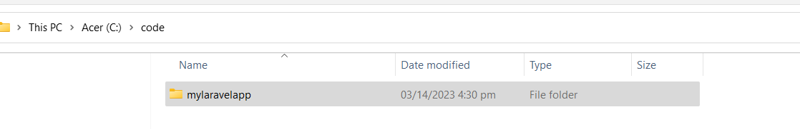

# Git

Git is a version control system used for tracking changes in files and coordinating work on those files among multiple people. It allows users to make and save changes to files while keeping a history of all changes made, making it easy to track changes, roll back to earlier versions, and collaborate with others on a project. Git is widely used in software development and is typically used in conjunction with a hosting service, such as GitHub or GitLab.

We will be using Git for all our sample projects in this guide.

### Installation

1. Download Git from the official website for your operating system. You can find the downloads at https://git-scm.com/downloads.

<figure><figcaption></figcaption></figure>

2. Run the installer and follow the prompts to install Git.

<figure><figcaption></figcaption></figure>

3. &#x20;You can choose the default options for most settings, but you may want to customize the installation location or choose a different text editor if you prefer.

.png>)

.png>)

.png>)

.png>)

.png>)

.png>)

.png>)

.png>)

.png>)

.png>)

.png>)

.png>)

.png>)

.png>)

.png>)

.png>)



.png>)

4. Once Git is installed, open a terminal or command prompt and type `git --version` to confirm that it is installed correctly. You should see the version number of Git printed in the terminal.

```shell
// git --version
git --version
git version 2.38.1.windows.1
```

5. Next, you'll want to configure Git with your name and email address. Type the following commands in the terminal, replacing "Your Name" and "[youremail@example.com](mailto:youremail@example.com)" with your own name and email address:

```bash
// git config
git config --global user.name "Your Name"
git config --global user.email youremail@example.com

```

6. That's it! You're now ready to start using Git. You can create a new repository with the `git init` command, or clone an existing repository with `git clone <repository URL>`. For more information on how to use Git, check out the official documentation at [https://git-scm.com/docs](https://git-scm.com/docs).

### Cloning a repository from GitHub

1. Once Git is installed, go to the GitHub website at [https://github.com/](https://github.com/) and sign up for a free account, if you haven't already.
2. Open a terminal or command prompt on your computer.
3. Follow and type the command below to create a directory for the repository.

```sh
// Create a directory
C:\Users\user>cd /

C:\>mkdir repo

C:\>cd repo

C:\repo>

```

4. Type the following command to clone the repository:

```powershell

C:\repo>git clone https://github.com/warbon/nuxt-app.git

```

5. Press Enter to execute the command. Git will clone the repository to your local computer, creating a new directory named "nuxt-app".

```powershell

C:\repo>git clone https://github.com/warbon/nuxt-app.git
Cloning into 'nuxt-app'...
remote: Enumerating objects: 12, done.
remote: Counting objects: 100% (12/12), done.
remote: Compressing objects: 100% (11/11), done.
remote: Total 12 (delta 0), reused 12 (delta 0), pack-reused 0
Receiving objects: 100% (12/12), 91.81 KiB | 380.00 KiB/s, done.

```

6. Type and enter the command below to check created "nuxt-app" directory:

```powershell

C:\repo>cd nuxt-app

C:\repo\nuxt-app>dir

```

7. It will show the files inside the "nuxt-app" directory:

```powershell
C:\repo\nuxt-app>dir
 Volume in drive C is Acer
 Volume Serial Number is BE4B-7CA6

 Directory of C:\repo\nuxt-app

03/03/2023  03:23 pm    <DIR>          .
03/03/2023  03:23 pm    <DIR>          ..
03/03/2023  03:23 pm                77 .gitignore
03/03/2023  03:23 pm                55 .npmrc
03/03/2023  03:23 pm                65 app.vue
03/03/2023  03:23 pm                97 nuxt.config.ts
03/03/2023  03:23 pm               252 package.json
03/03/2023  03:23 pm    <DIR>          public
03/03/2023  03:23 pm               655 README.md
03/03/2023  03:23 pm                98 tsconfig.json
03/03/2023  03:23 pm           229,050 yarn.lock
               8 File(s)        230,349 bytes
               3 Dir(s)  80,073,269,248 bytes free
               
```

8. Type and enter the command below to open it in VS Code:

```powershell

C:\repo\nuxt-app>code .

```

9. That's it! You've now cloned the repository to your local computer and can start working with the files in the repository.

<figure><figcaption></figcaption></figure>


This guide provides simple step-by-step instructions for installing Git and cloning a repository from GitHub. For more advanced usage and details on Git, please refer to other sections of this guide or the official Git documentation at [https://git-scm.com/docs](https://git-scm.com/docs).\


