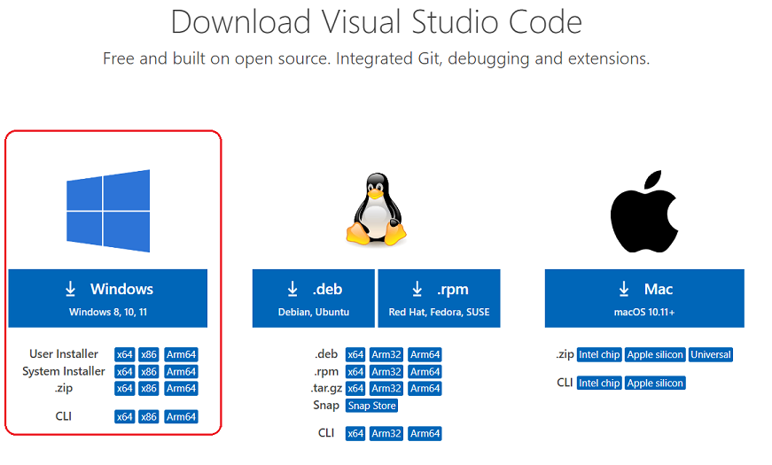
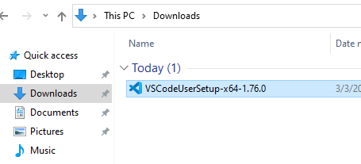
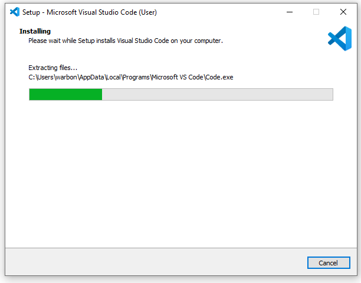

# Visual Studio Code (VS Code)

Visual Studio Code is a lightweight and powerful source code editor from Microsoft which runs on your desktop and is available for Windows, macOS, and Linux. It comes with built-in support for almost programming languages and frameworks.

### Installation

1. Download the [Visual Studio Code](https://code.visualstudio.com/download) installer for Windows.

<figure><figcaption></figcaption></figure>

2. Once the download is complete, run the installer.

<figure><figcaption></figcaption></figure>

3. Follow the prompts in the installer to install Visual Studio Code. You can choose the default options for most settings, but you may want to customize the installation location or choose which file types are associated with VS Code.

.png>)

.png>)

.png>)

.png>)

.png>)

.png>)

4. Once the installation is complete, open Visual Studio Code. You should see the welcome screen with a variety of options for creating and opening projects.

<figure><figcaption></figcaption></figure>

5. That's it! You're now ready to start using Visual Studio Code. You can customize your preferences, install extensions, and begin coding in your preferred language. For more information on how to use Visual Studio Code, check out the official documentation at [https://code.visualstudio.com/docs](https://code.visualstudio.com/docs).

